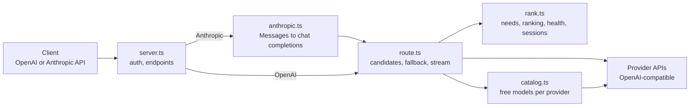

# Architecture

[Back to the README](../README.md)

onerouter is one Node.js process with no runtime dependencies. A request flows through five modules:

| File | Does |
| --- | --- |
| `src/cli.ts` | `serve`, `models`, `key`, `init` |
| `src/config.ts` | Reads `~/.onerouter/config.json` or environment variables; `env:NAME` keys |
| `src/providers.ts` | Provider kinds, their OpenAI-compatible URLs, auth headers, address rules |
| `src/catalog.ts` | Lists each provider's models and keeps only free ones (`isFree`); refreshed on a timer; a failing provider keeps its last list |
| `src/rank.ts` | What a request needs (`profileTask`), scoring (`rank`), health and cooldowns (`Health`), sticky conversations (`Sessions`) |
| `src/route.ts` | Chooses candidates, sends to each in turn, reads the stream until the first output (the commit point), provider fixes (`upstreamBody`) |
| `src/anthropic.ts` | Anthropic Messages to OpenAI chat completions, and OpenAI streams back to Anthropic events |
| `src/errors.ts` | Provider failures by category; which ones move on to the next model |
| `src/keys.ts` | Router keys, stored as hashes |
| `src/server.ts` | HTTP endpoints, auth, logging |

## The commit point

A streaming request is read record by record. Until a record carries output (text, reasoning, a tool call, or a finish reason), nothing has been sent to the client, so a failure (an HTTP error, an error record inside the stream, the stream ending, or silence past `firstOutputTimeoutMs`) moves on to the next model. The records held so far are discarded. After the first output, the rest of the stream is forwarded as it arrives, and a failure ends the response with an error record: another model is never spliced in.

Non-streaming requests fall back on any failure, since nothing is sent until the whole answer is in.

## State

| State | Where | Lifetime |
| --- | --- | --- |
| Free models | `Catalog`, memory | Refreshed every `refreshMinutes` |
| Health, cooldowns | `Health`, memory, keyed by a hash of provider, address, and key, plus model | Process |
| Conversation to model | `Sessions`, memory, at most 2,000, one hour each | Process |
| Router keys | `~/.onerouter/keys.json`, hashes | Until revoked |

## Origin

The ranking, health, fallback rules, and free-price checks are ported from the One Router in [One Router](https://github.com/sanketmuchhala/One Router) (`backend/src/runtime/router.ts`), which documents the scoring in detail (`backend/docs/onerouter.md`). What is new here: serving OpenAI and Anthropic clients directly, tool calls passed through from the client, sticky conversations, per-model output caps, and router keys.
